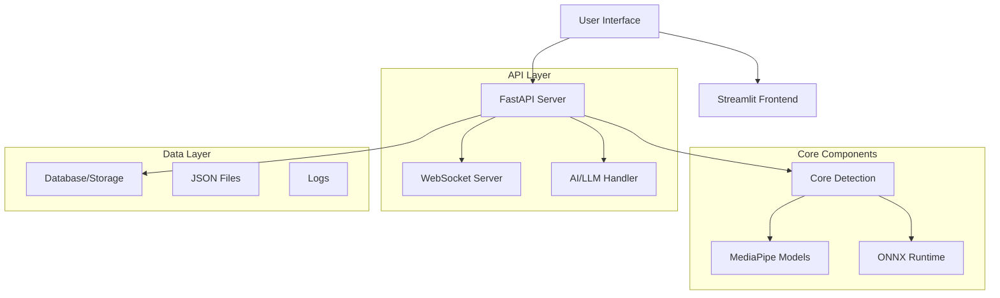

# Edgefit-Coach Development Guide

## 📋 Table of Contents

1. [Project Architecture](#project-architecture)
2. [Development Setup](#development-setup)
3. [Code Structure](#code-structure)
4. [API Documentation](#api-documentation)
5. [Testing Guidelines](#testing-guidelines)
6. [Deployment](#deployment)
7. [Contributing](#contributing)

## 🏗️ Project Architecture

### System Overview



### Component Responsibilities

| Component | Purpose | Key Files |
|-----------|---------|-----------|
| **Core Detection** | Real-time pose detection and analysis | `src/core/main_webcam*.py` |
| **API Server** | REST API and WebSocket communication | `src/api/api_server.py` |
| **Frontend** | Web-based user interface | `src/frontend/frontend_test.py` |
| **Utils** | Helper functions and utilities | `src/utils/*.py` |
| **Models** | AI models and inference | `src/models/*.py` |

## 🛠️ Development Setup

### Prerequisites

- Python 3.11+
- Git
- Webcam/Camera device
- Windows 10+ or Linux Ubuntu 18.04+

### Environment Setup

```bash
# 1. Clone repository
git clone <repository-url>
cd Edgefit-Coach

# 2. Create virtual environment
python -m venv venv

# Windows
venv\Scripts\activate

# Linux/Mac
source venv/bin/activate

# 3. Install dependencies
pip install -r requirements.txt

# 4. Install platform-specific notifications
# Windows
pip install win10toast plyer

# Linux
pip install notify2

# 5. Setup configuration
cp config/config.yaml.example config/config.yaml
# Edit config.yaml with your API keys
```

### IDE Configuration

#### VS Code Settings
```json
{
    "python.defaultInterpreterPath": "./venv/Scripts/python.exe",
    "python.linting.enabled": true,
    "python.linting.flake8Enabled": true,
    "python.formatting.provider": "black",
    "python.formatting.blackArgs": ["--line-length", "88"]
}
```

#### PyCharm Settings
- Set Python interpreter to `./venv/Scripts/python.exe`
- Enable Black formatter
- Configure Flake8 linter
- Set line length to 88 characters

## 📁 Code Structure

### Directory Layout

```
src/
├── core/                     # Core posture detection
│   ├── __init__.py
│   ├── main_webcam.py        # GUI-based monitoring
│   ├── main_webcam_headless.py  # Basic headless
│   └── main_webcam_headless1.py # Enhanced headless
├── api/                      # API and WebSocket
│   ├── __init__.py
│   ├── api_server.py         # FastAPI application
│   └── websocket_server.py   # WebSocket server
├── frontend/                 # Web interface
│   ├── __init__.py
│   └── frontend_test.py      # Streamlit app
├── utils/                    # Utility functions
│   ├── __init__.py
│   ├── llm_handler.py        # AI communication
│   ├── posture_db.py         # Data processing
│   ├── dashboard_viewer.py   # Report generation
│   └── video_streamer*.py    # Video streaming
└── models/                   # AI models
    ├── __init__.py
    ├── *.onnx               # Pre-trained models
    └── main_*.py            # Model implementations
```

### Coding Standards

#### Python Style Guide
- Follow PEP 8 guidelines
- Use Black formatter (line length: 88)
- Type hints for all function parameters and returns
- Comprehensive docstrings for all functions and classes

#### Function Documentation Template
```python
def function_name(param1: Type1, param2: Type2) -> ReturnType:
    """
    Brief description of function purpose.
    
    Detailed explanation of what the function does, including
    any important implementation details or algorithms used.
    
    Args:
        param1 (Type1): Description of first parameter
        param2 (Type2): Description of second parameter
    
    Returns:
        ReturnType: Description of return value
        
    Raises:
        ExceptionType: Description of when this exception is raised
        
    Example:
        >>> result = function_name("example", 42)
        >>> print(result)
        Expected output
    
    Note:
        Any additional notes or warnings about usage.
    """
    pass
```

#### Class Documentation Template
```python
class ClassName:
    """
    Brief description of class purpose.
    
    Detailed explanation of the class functionality, its role
    in the system, and any important usage patterns.
    
    Attributes:
        attribute1 (Type): Description of attribute
        attribute2 (Type): Description of attribute
    
    Example:
        >>> instance = ClassName(param1, param2)
        >>> result = instance.method()
        >>> print(result)
        Expected output
    """
    
    def __init__(self, param1: Type1, param2: Type2):
        """Initialize the class with given parameters."""
        pass
```

## 🔧 API Documentation

### Authentication
Currently, the API uses simple configuration-based authentication. For production:

```python
# config/config.yaml
api_key: "your-secure-api-key"
model_server_base_url: "https://your-ai-api-endpoint"
workspace_slug: "your-workspace"
```

### Endpoint Categories

#### 1. Video Streaming Endpoints

```python
# Start video stream
POST /video/start
Response: {"status": "started", "stream_url": "http://localhost:8000/video/stream"}

# Stop video stream  
POST /video/stop
Response: {"status": "stopped"}

# Get stream status
GET /video/status
Response: {"streaming": true, "uptime": 120.5}
```

#### 2. Dashboard Data Endpoints

```python
# Get analytics data
GET /dashboard/data
Response: {
    "posture_metrics": {...},
    "performance_stats": {...},
    "recent_sessions": [...]
}

# Refresh dashboard
POST /dashboard/refresh
Response: {"status": "refreshed", "timestamp": "2024-01-01T12:00:00Z"}
```

#### 3. AI Chat Endpoints

```python
# Send message to AI
POST /chat/message
Body: {"message": "How can I improve my posture?"}
Response: {
    "response": "Here are some tips...",
    "timestamp": "2024-01-01T12:00:00Z",
    "conversation_id": "uuid"
}

# Get chat history
GET /chat/history?limit=20
Response: {
    "conversations": [...],
    "total": 50
}
```

### WebSocket Communication

```javascript
// Connect to motivation WebSocket
const ws = new WebSocket('ws://localhost:8001/');

ws.onmessage = function(event) {
    const data = JSON.parse(event.data);
    console.log('Motivation:', data.quote);
    console.log('Performance:', data.performance);
};
```

## 🧪 Testing Guidelines

### Test Structure

```
tests/
├── test_notifications.py    # Desktop notification tests
├── test_api_endpoints.py    # API endpoint tests
├── test_websocket_client.py # WebSocket tests
├── unit/                    # Unit tests
│   ├── test_posture_detection.py
│   ├── test_llm_handler.py
│   └── test_dashboard.py
└── integration/             # Integration tests
    ├── test_full_workflow.py
    └── test_api_integration.py
```

### Running Tests

```bash
# Run all tests
python -m pytest tests/

# Run specific test file
python tests/test_notifications.py

# Run with coverage
python -m pytest tests/ --cov=src --cov-report=html

# Run integration tests
python -m pytest tests/integration/
```

### Test Writing Guidelines

```python
import pytest
from unittest.mock import Mock, patch
from src.core.main_webcam_headless1 import PostureLogger

class TestPostureLogger:
    """Test suite for PostureLogger class."""
    
    def setup_method(self):
        """Setup test fixtures before each test method."""
        self.logger = PostureLogger(
            log_interval=1.0,
            window_duration=5.0,
            summary_file="test_summary.json"
        )
    
    def test_initialization(self):
        """Test proper initialization of PostureLogger."""
        assert self.logger.log_interval == 1.0
        assert self.logger.window_duration == 5.0
        assert self.logger.good_posture_count == 0
    
    @patch('time.time')
    def test_should_log_posture(self, mock_time):
        """Test posture logging timing logic."""
        mock_time.return_value = 10.0
        self.logger.last_log_time = 9.0
        
        assert self.logger.should_log_posture() == True
    
    def teardown_method(self):
        """Cleanup after each test method."""
        # Clean up test files
        import os
        if os.path.exists("test_summary.json"):
            os.remove("test_summary.json")
```

## 🚀 Deployment

### Local Development

```bash
# Start all components
python edgefit_coach.py web

# Or start individually
python src/api/websocket_server.py     # Terminal 1
python src/api/api_server.py           # Terminal 2
streamlit run src/frontend/frontend_test.py --server.port 8501  # Terminal 3
```

### Production Deployment

#### Using Docker

```dockerfile
# Dockerfile
FROM python:3.11-slim

WORKDIR /app
COPY requirements.txt .
RUN pip install -r requirements.txt

COPY src/ ./src/
COPY config/ ./config/
COPY scripts/ ./scripts/

EXPOSE 8000 8001 8501

CMD ["python", "scripts/start_app.py"]
```

```bash
# Build and run
docker build -t edgefit-coach .
docker run -p 8000:8000 -p 8001:8001 -p 8501:8501 edgefit-coach
```

#### Using systemd (Linux)

```ini
# /etc/systemd/system/edgefit-coach.service
[Unit]
Description=Edgefit-Coach Posture Monitoring
After=network.target

[Service]
Type=simple
User=edgefit
WorkingDirectory=/opt/edgefit-coach
ExecStart=/opt/edgefit-coach/venv/bin/python edgefit_coach.py web
Restart=always
RestartSec=10

[Install]
WantedBy=multi-user.target
```

```bash
# Enable and start service
sudo systemctl enable edgefit-coach
sudo systemctl start edgefit-coach
sudo systemctl status edgefit-coach
```

### Environment Variables

```bash
# Production environment variables
export EDGEFIT_ENV=production
export EDGEFIT_LOG_LEVEL=INFO
export EDGEFIT_DATA_DIR=/var/lib/edgefit-coach
export EDGEFIT_CONFIG_FILE=/etc/edgefit-coach/config.yaml
```

## 🤝 Contributing

### Development Workflow

1. **Fork and Clone**
   ```bash
   git clone https://github.com/your-username/edgefit-coach.git
   cd edgefit-coach
   ```

2. **Create Feature Branch**
   ```bash
   git checkout -b feature/amazing-feature
   ```

3. **Make Changes**
   - Follow coding standards
   - Add comprehensive tests
   - Update documentation

4. **Test Changes**
   ```bash
   python -m pytest tests/
   python -m flake8 src/
   python -m black src/ --check
   ```

5. **Commit and Push**
   ```bash
   git add .
   git commit -m "Add amazing feature"
   git push origin feature/amazing-feature
   ```

6. **Create Pull Request**
   - Provide clear description
   - Reference related issues
   - Include test results

### Code Review Checklist

- [ ] Code follows PEP 8 style guidelines
- [ ] All functions have comprehensive docstrings
- [ ] Type hints are provided for parameters and returns
- [ ] Tests are included for new functionality
- [ ] Documentation is updated
- [ ] No breaking changes without migration guide
- [ ] Performance impact is considered
- [ ] Security implications are reviewed

### Issue Reporting

When reporting issues, include:

1. **Environment Information**
   - OS version and type
   - Python version
   - Package versions (`pip freeze`)

2. **Steps to Reproduce**
   - Exact commands run
   - Configuration used
   - Input data/parameters

3. **Expected vs Actual Behavior**
   - What should happen
   - What actually happens
   - Error messages/logs

4. **Additional Context**
   - Screenshots if applicable
   - Related issues/PRs
   - Potential solutions

### Release Process

1. **Version Bumping**
   ```bash
   # Update version in src/__init__.py
   __version__ = "1.1.0"
   
   # Update CHANGELOG.md
   # Tag release
   git tag -a v1.1.0 -m "Release version 1.1.0"
   git push origin v1.1.0
   ```

2. **Release Notes**
   - Summarize new features
   - List bug fixes
   - Note breaking changes
   - Include migration guide if needed

---

## 📞 Support

For development questions:
- Check existing [issues](../../issues)
- Review [documentation](../README.md)
- Join development discussions
- Contact maintainers

**Happy coding! 🚀** 